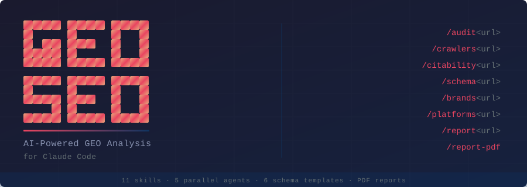

*written by ForgeCat*


# GEO SEO Claude

GEO-first SEO toolkit for auditing and optimizing websites for AI-powered search visibility while preserving traditional SEO foundations.

## Tags

- geo
- seo
- ai-search
- claude-code
- audit

## Installation

```bash
npx forgecat install @forgecat/zubair-trabzada_geo-seo-claude
```

## Skills / Agents / Commands

- **geo** — GEO-first SEO analysis tool. Optimizes websites for AI-powered search engines (ChatGPT, Claude, Perplexity, Gemini, Google AI Overviews) while maintaining traditional SEO foundations. Performs full GEO audits, citability scoring, AI crawler analysis, llms.txt generation, brand mention scanning, platform-specific optimization, schema markup, technical SEO, content quality (E-E-A-T), and client-ready GEO report generation. Use when user says "geo", "seo", "audit", "AI search", "AI visibility", "optimize", "citability", "llms.txt", "schema", "brand mentions", "GEO report", or any URL for analysis. `skill`
- **geo-audit** — Full website GEO+SEO audit with parallel subagent delegation. Orchestrates a comprehensive Generative Engine Optimization audit across AI citability, platform analysis, technical infrastructure, content quality, and schema markup. Produces a composite GEO Score (0-100) with prioritized action plan. `skill`
- **geo-brand-mentions** — Brand mention and authority scanner for AI visibility. Analyzes brand presence across platforms that AI models rely on for entity recognition and citation decisions. Produces a Brand Authority Score (0-100) with platform-specific recommendations. `skill`
- **geo-citability** — AI citability scoring and optimization. Analyzes web page content to determine how likely AI systems (ChatGPT, Claude, Perplexity, Gemini) are to cite or quote passages from the page. Provides a citability score (0-100) with specific rewrite suggestions. `skill`
- **geo-compare** — Monthly delta tracking and progress reporting for GEO clients. Compares two GEO audits (baseline vs. current), calculates score improvements across all categories, tracks action item completion, and generates a "here's your progress" client report. Use when user says "compare", "delta", "monthly report", "progress", "confronta", "progressi", "report mensile", or when running a monthly client check-in. `skill`
- **geo-content** — Content quality and E-E-A-T assessment for AI citability — evaluate experience, expertise, authoritativeness, trustworthiness, and content structure `skill`
- **geo-crawlers** — AI crawler access analysis. Checks robots.txt, meta tags, and HTTP headers to determine which AI crawlers can access the site. Provides a complete access map and recommendations for maximizing AI visibility while maintaining appropriate control. `skill`
- **geo-llmstxt** — Analyzes and generates llms.txt files -- the emerging standard for helping AI systems understand website structure and content. Can validate existing llms.txt files or generate new ones from scratch by crawling the site. `skill`
- **geo-platform-optimizer** — Platform-specific AI search optimization — audit and optimize for Google AI Overviews, ChatGPT, Perplexity, Gemini, and Bing Copilot individually `skill`
- **geo-proposal** — Auto-generate a professional, client-ready GEO service proposal from audit data. Creates a full proposal in markdown and PDF including executive summary, findings, recommended service packages (Basic/Standard/Premium), pricing, timeline, and terms. Use when user says "proposal", "proposta", "offerta", "preventivo", "generate proposal", or after completing a GEO audit for a prospect. `skill`
- **geo-prospect** — CRM-lite for managing GEO agency prospects and clients. Track leads through the full sales pipeline: Lead → Qualified → Proposal Sent → Won → Lost. Store audit history, notes, deal values, and generate pipeline summaries. Use when user says "prospect", "lead", "client", "pipeline", "crm", "nuovo prospect", "aggiungi cliente", or when managing the business side of GEO services. `skill`
- **geo-report** — Generate a professional, client-facing GEO report combining all audit results into a single deliverable with scores, findings, and prioritized actions `skill`
- **geo-report-pdf** — Generate a professional PDF report from a GEO audit using pandoc + Chrome headless. Converts GEO-AUDIT-REPORT.md into a styled, client-ready PDF with a cover page, color-coded score tables, severity-tagged findings, and a 90-day roadmap. `skill`
- **geo-schema** — Schema.org structured data audit and generation optimized for AI discoverability — detect, validate, and generate JSON-LD markup `skill`
- **geo-technical** — Technical SEO audit with GEO-specific checks — crawlability, indexability, security, performance, SSR, and AI crawler access `skill`
- **geo-update** — Pull the latest GEO-SEO skill updates from the upstream repository. Compares installed files against the latest release, shows what changed, and updates all skills, agents, scripts, and schema templates in place. `skill`
- **geo-ai-visibility** — GEO specialist analyzing AI search visibility: citability scoring, AI crawler access, llms.txt compliance, and brand mention presence across AI-cited platforms. Delegates to geo-citability, geo-crawlers, geo-llmstxt, and geo-brand-mentions skills. `agent`
- **geo-content** — Content quality specialist evaluating E-E-A-T signals (Experience, Expertise, Authoritativeness, Trustworthiness), content depth, readability, AI content detection, and topical authority. `agent`
- **geo-platform-analysis** — Platform optimization specialist analyzing readiness for Google AI Overviews, ChatGPT web search, Perplexity AI, Google Gemini, and Bing Copilot. `agent`
- **geo-schema** — Schema markup specialist detecting, validating, and generating structured data (JSON-LD preferred). Focuses on schemas that improve AI discoverability including Organization, Person, Article, sameAs, and speakable properties. `agent`
- **geo-technical** — Technical SEO specialist analyzing crawlability, indexability, security, URL structure, mobile optimization, Core Web Vitals (INP replaces FID), server-side rendering, and JavaScript dependency. `agent`

## Details

| Field | Value |
|---|---|
| Author | zubair-trabzada |
| Original repository | https://github.com/zubair-trabzada/geo-seo-claude |
| Version | `pending-registry-publish` |
| Original commit | 9eec32f5f700a1e6c3cb1cb735a56ee5ec49a964 |
| License | MIT |
| Source platform | claude-code |

## Compatibility

### Platforms

| Platform | Status |
|---|---|
| Claude Code | Partial |
| Cursor | Partial |
| Codex | Partial |

## Dependencies

- Python 3.8+
- Optional Python packages listed in `skills/geo/requirements.txt`
- Optional Playwright/Pandoc/Chrome dependencies for screenshot and PDF workflows, as described by the upstream documentation

---
*written by original source*

<p align="center">
  
</p>

<p align="center">
  <strong>GEO-first, SEO-supported.</strong> Optimize websites for AI-powered search engines<br/>
  (ChatGPT, Claude, Perplexity, Gemini, Google AI Overviews) while maintaining traditional SEO foundations.
</p>

<p align="center">
  AI search is eating traditional search. This tool optimizes for where traffic is going, not where it was.
</p>

---

## Star History

[](https://www.star-history.com/#zubair-trabzada/geo-seo-claude&Date)

---

## Why GEO Matters (2026)

| Metric | Value |
|--------|-------|
| GEO services market | $850M+ (projected $7.3B by 2031) |
| AI-referred traffic growth | +527% year-over-year |
| AI traffic conversion rate vs organic | 4.4x higher |
| Gartner: search traffic drop by 2028 | -50% |
| Brand mentions vs backlinks for AI | 3x stronger correlation |
| Marketers investing in GEO | Only 23% |

---

## Quick Start

### One-Command Install (macOS/Linux)

```bash
curl -fsSLO https://raw.githubusercontent.com/zubair-trabzada/geo-seo-claude/main/install.sh
# Review install.sh before running it.
bash install.sh
```

### Manual Install

```bash
git clone https://github.com/zubair-trabzada/geo-seo-claude.git
cd geo-seo-claude
./install.sh
```

### Windows (Git Bash)

Requires [Git for Windows](https://git-scm.com/downloads) which includes Git Bash.

```bash
# Option 1: One-command install (run from Git Bash, not PowerShell/CMD)
curl -fsSLO https://raw.githubusercontent.com/zubair-trabzada/geo-seo-claude/main/install-win.sh
# Review install-win.sh before running it.
bash install-win.sh

# Option 2: Manual install
git clone https://github.com/zubair-trabzada/geo-seo-claude.git
cd geo-seo-claude
./install-win.sh
```

> **Note:** Right-click the folder and select "Open Git Bash here", or open Git Bash and navigate to the directory. Do not use PowerShell or Command Prompt.

### Requirements

- Python 3.8+ (on Debian/Ubuntu also `python3-venv`)
- Claude Code CLI
- Git
- Optional: [`uv`](https://docs.astral.sh/uv/) — if present, the installer uses it for a faster dependency install
- Optional: Playwright (for screenshots)

### Isolated install

Python dependencies are installed into a dedicated virtual environment at
`~/.claude/skills/geo/.venv/`. Your system Python is **not** touched, and
uninstalling the skill removes the venv together with the rest of the files.

Skill and agent files reference that venv directly, so the tool works
regardless of what `python3` resolves to on your `PATH`.

---

## Commands

Open Claude Code and use these commands:

| Command | What It Does |
|---------|-------------|
| `/geo audit <url>` | Full GEO + SEO audit with parallel subagents |
| `/geo quick <url>` | 60-second GEO visibility snapshot |
| `/geo citability <url>` | Score content for AI citation readiness |
| `/geo crawlers <url>` | Check AI crawler access (robots.txt) |
| `/geo llmstxt <url>` | Analyze or generate llms.txt |
| `/geo brands <url>` | Scan brand mentions across AI-cited platforms |
| `/geo platforms <url>` | Platform-specific optimization |
| `/geo schema <url>` | Structured data analysis & generation |
| `/geo technical <url>` | Technical SEO audit |
| `/geo content <url>` | Content quality & E-E-A-T assessment |
| `/geo report <url>` | Generate client-ready GEO report |
| `/geo report-pdf` | Generate professional PDF report with charts & visualizations |

---

## Architecture

```
geo-seo-claude/
├── geo/                          # Main skill orchestrator
│   └── SKILL.md                  # Primary skill file with commands & routing
├── skills/                       # 13 specialized sub-skills
│   ├── geo-audit/                # Full audit orchestration & scoring
│   ├── geo-citability/           # AI citation readiness scoring
│   ├── geo-crawlers/             # AI crawler access analysis
│   ├── geo-llmstxt/              # llms.txt standard analysis & generation
│   ├── geo-brand-mentions/       # Brand presence on AI-cited platforms
│   ├── geo-platform-optimizer/   # Platform-specific AI search optimization
│   ├── geo-schema/               # Structured data for AI discoverability
│   ├── geo-technical/            # Technical SEO foundations
│   ├── geo-content/              # Content quality & E-E-A-T
│   ├── geo-report/               # Client-ready markdown report generation
│   ├── geo-report-pdf/           # Professional PDF report with charts
│   ├── geo-prospect/             # CRM-lite prospect pipeline management
│   ├── geo-proposal/             # Auto-generate client proposals
│   └── geo-compare/              # Monthly delta tracking & progress reports
├── agents/                       # 5 parallel subagents
│   ├── geo-ai-visibility.md      # GEO audit, citability, crawlers, brands
│   ├── geo-platform-analysis.md  # Platform-specific optimization
│   ├── geo-technical.md          # Technical SEO analysis
│   ├── geo-content.md            # Content & E-E-A-T analysis
│   └── geo-schema.md             # Schema markup analysis
├── scripts/                      # Python utilities
│   ├── fetch_page.py             # Page fetching & parsing
│   ├── citability_scorer.py      # AI citability scoring engine
│   ├── brand_scanner.py          # Brand mention detection
│   ├── llmstxt_generator.py      # llms.txt validation & generation
│   └── generate_pdf_report.py    # PDF report generator (ReportLab)
├── schema/                       # JSON-LD templates
│   ├── organization.json         # Organization schema (with sameAs)
│   ├── local-business.json       # LocalBusiness schema
│   ├── article-author.json       # Article + Person schema (E-E-A-T)
│   ├── software-saas.json        # SoftwareApplication schema
│   ├── product-ecommerce.json    # Product schema with offers
│   └── website-searchaction.json # WebSite + SearchAction schema
├── install.sh                    # One-command installer
├── uninstall.sh                  # Uninstaller
├── requirements.txt              # Python dependencies
└── README.md                     # This file
```

---

## Data Storage

The CRM and reporting skills (`/geo prospect`, `/geo proposal`, `/geo compare`) store runtime data outside the Claude Code directory:

```
~/.geo-prospects/
├── prospects.json              # Client/prospect pipeline data
├── proposals/                  # Generated proposal documents
│   └── <domain>-proposal-<date>.md
└── reports/                    # Monthly delta reports
    └── <domain>-monthly-<YYYY-MM>.md
```

This directory is **not removed** by the uninstaller — delete it manually if you no longer need your prospect data.

---

## How It Works

### Full Audit Flow

When you run `/geo audit https://example.com`:

1. **Discovery** — Fetches homepage, detects business type, crawls sitemap
2. **Parallel Analysis** — Launches 5 subagents simultaneously:
   - AI Visibility (citability, crawlers, llms.txt, brand mentions)
   - Platform Analysis (ChatGPT, Perplexity, Google AIO readiness)
   - Technical SEO (Core Web Vitals, SSR, security, mobile)
   - Content Quality (E-E-A-T, readability, freshness)
   - Schema Markup (detection, validation, generation)
3. **Synthesis** — Aggregates scores, generates composite GEO Score (0-100)
4. **Report** — Outputs prioritized action plan with quick wins

### Scoring Methodology

| Category | Weight |
|----------|--------|
| AI Citability & Visibility | 25% |
| Brand Authority Signals | 20% |
| Content Quality & E-E-A-T | 20% |
| Technical Foundations | 15% |
| Structured Data | 10% |
| Platform Optimization | 10% |

---

## Key Features

### Citability Scoring
Analyzes content blocks for AI citation readiness. Optimal AI-cited passages are 134-167 words, self-contained, fact-rich, and directly answer questions.

### AI Crawler Analysis
Checks robots.txt for 14+ AI crawlers (GPTBot, ClaudeBot, PerplexityBot, etc.) and provides specific allow/block recommendations.

### Brand Mention Scanning
Brand mentions correlate 3x more strongly with AI visibility than backlinks. Scans YouTube, Reddit, Wikipedia, LinkedIn, and 7+ other platforms.

### Platform-Specific Optimization
Only 11% of domains are cited by both ChatGPT and Google AI Overviews for the same query. Provides tailored recommendations per platform.

### llms.txt Generation
Generates the emerging llms.txt standard file that helps AI crawlers understand your site structure.

### Client-Ready Reports
Generates professional GEO reports in markdown or PDF format. PDF reports include score gauges, bar charts, platform readiness visualizations, color-coded tables, and prioritized action plans — ready to deliver to clients.

---

## Use Cases

- **GEO Agencies** — Run client audits and generate deliverables
- **Marketing Teams** — Monitor and improve AI search visibility
- **Content Creators** — Optimize content for AI citations
- **Local Businesses** — Get found by AI assistants
- **SaaS Companies** — Improve entity recognition across AI platforms
- **E-commerce** — Optimize product pages for AI shopping recommendations

---

## Uninstall

```bash
./uninstall.sh
```

Or manually:
```bash
# Remove only the listed GEO-SEO Claude files after reviewing the paths.
python3 - <<'PYRM'
from pathlib import Path
import shutil
for p in [Path.home()/'.claude/skills/geo']:
    shutil.rmtree(p, ignore_errors=True)
for base, pattern in [(Path.home()/'.claude/skills', 'geo-*'), (Path.home()/'.claude/agents', 'geo-*.md')]:
    for item in base.glob(pattern):
        if item.is_dir(): shutil.rmtree(item, ignore_errors=True)
        else: item.unlink(missing_ok=True)
PYRM
```

---

## Want to Turn This Into a Business?

The tool is free. Learning how to monetize it is where the community comes in.

**[Join the AI Workshop Community →](https://skool.com/aiworkshop)**

Inside you'll get:
- **Video walkthroughs** — Step-by-step setup, running audits, reading results
- **Client acquisition playbook** — How to find prospects, pitch GEO services, and close deals
- **Live office hours** — Bring your audit results, get direct help
- **GEO agency pricing & templates** — Proposal docs, cold outreach scripts, onboarding workflows

GEO agencies charge $2K–$12K/month. This tool does the audit. The community teaches you how to sell it.

---


## License

MIT License

---

## Contributing

Contributions welcome!

---

Built for the AI search era.
